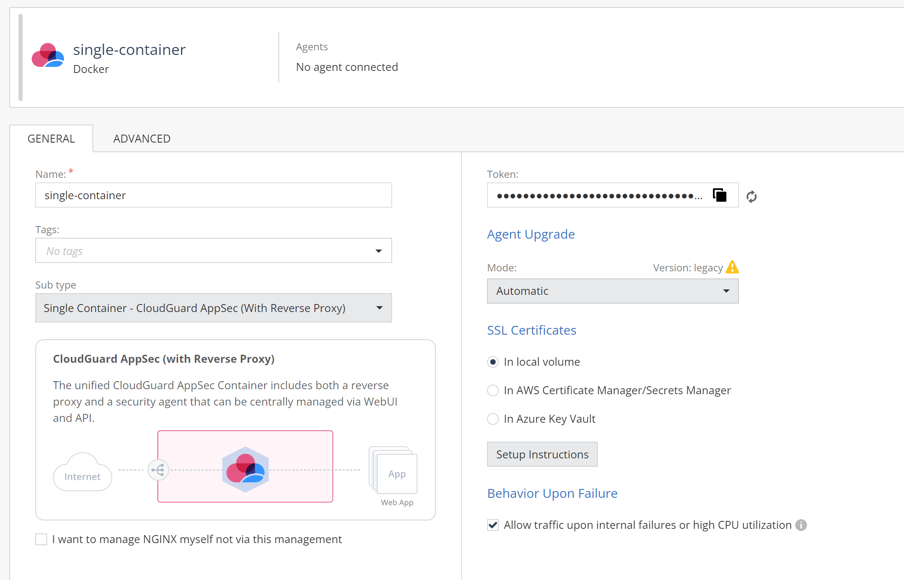
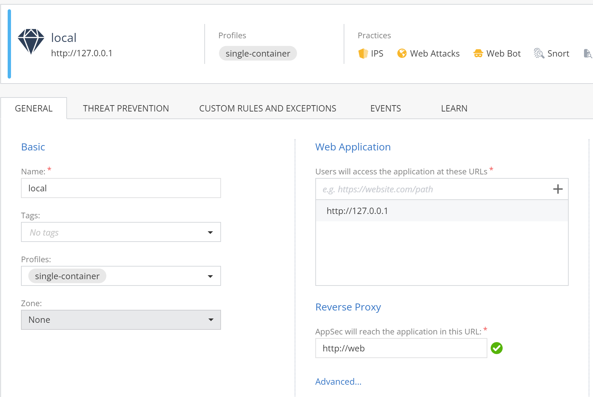
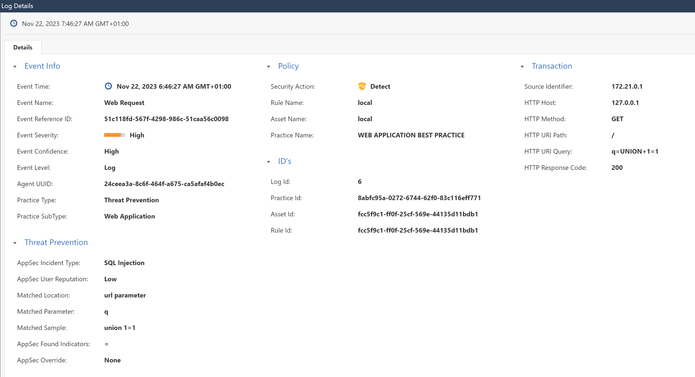

https://multipass.run/

```bash
# Create a VM
multipass launch -n appsecvm --cloud-init cloud-init.yaml -c 4 -d 20G -m 4G
# mount from host PC
multipass set local.privileged-mounts=Yes
multipass mount $(pwd) appsecvm:/home/ubuntu/w
multipass mount $(pwd) appsecvm:/home/vmuser/w

# Connect to the VM
multipass shell appsecvm

# inside the VM
export CPTOKEN=cp-eca25d-USEYOUROWN
cd ; docker-compose  -f ./w/docker-compose.yaml up -d
docker-compose  -f ./w/docker-compose.yaml logs -ft 


# diag
docker exec -it agent-container cpnano -s
docker exec -it agent-container nginx -V 
docker exec -it agent-container nginx -T 
docker exec -it agent-container curl web
docker exec -it agent-container curl 172.17.0.1:8081

# incident
 curl 127.0.0.1/?q=UNION+1=1

# cleanup
multipass delete appsecvm -p
```

AppSec profile - to obtain CPTOKEN env var


AppSec asset for http://127.0.0.1


Incident
