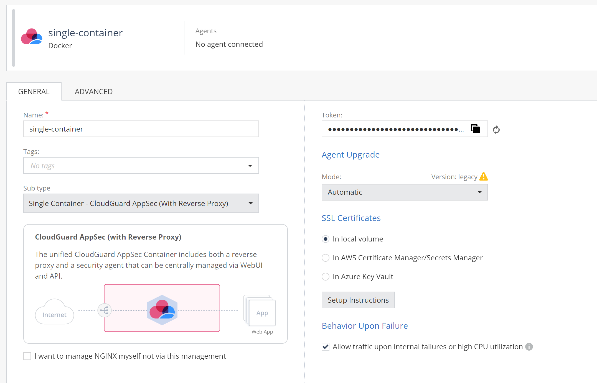
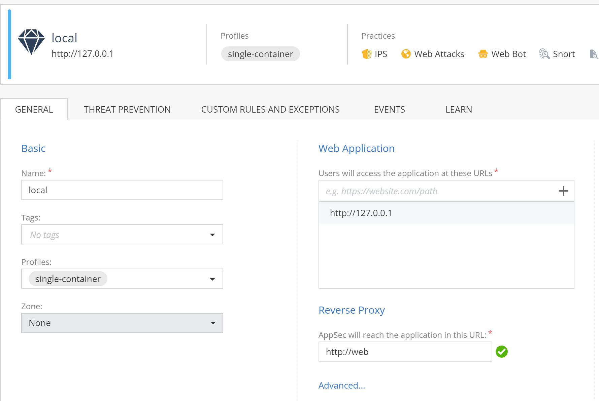
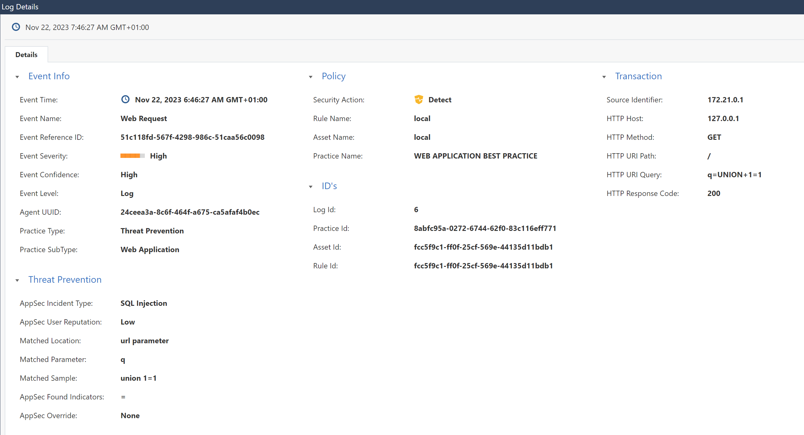

https://multipass.run/

```bash
# Create a VM
multipass launch -n appsecvm --cloud-init cloud-init.yaml -c 4 -d 20G -m 4G
# mount from host PC
multipass exec appsecvm -- uname -a
multipass set local.privileged-mounts=Yes
multipass mount $(pwd) appsecvm:/home/ubuntu/w
multipass mount $(pwd) appsecvm:/home/vmuser/w

# Connect to the VM
multipass shell appsecvm

# inside the VM
export CPTOKEN=cp-eca25d-USEYOUROWN
cd ; docker compose  -f ./w/docker-compose.yaml up -d
docker compose  -f ./w/docker-compose.yaml logs -ft 


# Connect to the VM - one more terminal
multipass shell appsecvm
# diag
docker exec -it agent-container cpnano -s
docker exec -it agent-container nginx -V 
docker exec -it agent-container nginx -T 
docker exec -it agent-container curl web
docker exec -it agent-container curl 172.17.0.1:8081

docker exec -it agent-container find /var/log/nginx/ -type f
docker exec -it agent-container tail -F /var/log/nginx/accessLog_80_127.0.0.1.log
docker exec -it agent-container tail -F /var/log/nginx/access.log
docker exec -it agent-container tail -F /var/log/nginx/error.log

# incident
curl '127.0.0.1/?q=UNION+1=1'
# no incident
curl '127.0.0.1/?q=hello'

# some response code stats
for ((n=0;n<50;n++)); do curl -s -o /dev/null -w "%{http_code}" '127.0.0.1/?q=UNION+1=1'; echo; done | sort | uniq -c | sort

for ((n=0;n<50;n++)); do curl -s -o /dev/null -w "%{http_code}" '127.0.0.1/?q=ok'; echo; done | sort | uniq -c | sort
docker stop web
for ((n=0;n<50;n++)); do curl -s -o /dev/null -w "%{http_code}" '127.0.0.1/?q=ok' -m1; echo; done | sort | uniq -c | sort
docker start web
for ((n=0;n<50;n++)); do curl -s -o /dev/null -w "%{http_code}" '127.0.0.1/?q=ok' -m1; echo; done | sort | uniq -c | sort

# cleanup
multipass delete appsecvm -p
```

AppSec profile - to obtain CPTOKEN env var


AppSec asset for http://127.0.0.1


Incident
